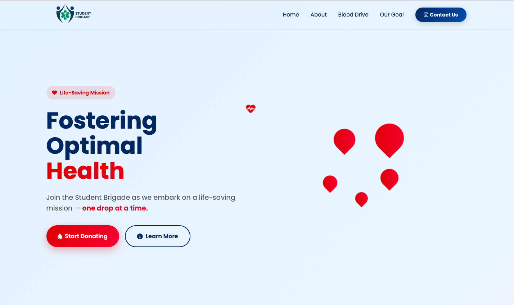

# Students Brigade Blood Donation Tracker 🩸

A real-time blood donation dashboard built for The Students Brigade to track pints donated and lives saved during their annual blood drive campaign.

## 🔍 Overview

### 🔹 Public Dashboard (thestudentbrigade.vercel.app)

This project has two core versions:

1. **Functional Tracker**:  
   A lightweight, secure admin interface where authorized members of The Students Brigade log blood donations.  
   👉 [Live Demo (Admin Use)](https://students-brigade.vercel.app)

2. **Public Landing Page Dashboard**:  
   A beautifully designed dashboard that fetches real-time data from the backend to display the total pints donated and estimated lives saved.  
   👉 [Live Public Page](https://thestudentbrigade.vercel.app)

---

## 💡 Features

- ✅ Real-time donation tracking
- ✅ Supabase-powered persistent storage
- ✅ Live sync between frontend and backend
- ✅ 1 pint = 3 lives logic
- ✅ Optimized for tablets & mobile use (iPad landscape-ready)
- ✅ Animated number counters
- ✅ Fully responsive UI using Tailwind CSS
- ✅ Secure backend integration with hidden endpoints

---

## ⚙️ Tech Stack

| Layer        | Tool / Framework |
|--------------|------------------|
| **Frontend** | HTML, Tailwind CSS, JavaScript |
| **Backend**  | Node.js, Express |
| **Database** | Supabase (PostgreSQL + REST API) |
| **Hosting**  | Vercel (frontend) + Render (backend) |

---

## 🧩 How It Works

- Admins use the **functional tracker** to add or remove pints donated.
- The backend (Node.js + Express) updates and retrieves the total from **Supabase**.
- The **public dashboard** uses `fetch()` to retrieve the count and display:
  - 🩸 Total pints donated
  - ❤️ Estimated lives saved (`pints * 3`)
- All counts persist across sessions and devices.

---

## 📁 Folder Structure (Functional Tracker)

students-brigade/
├── index.html
├── style.css
├── script.js
├── server.js
├── package.json
└── hosted on Render

---

## 🚀 Deployment

- **Frontend**: Deployed via [Vercel](https://vercel.com)
- **Backend**: Deployed via [Render](https://render.com)
- Supabase handles secure data storage with anonymous API access and protected tables.

---

## 🔒 Security

- The backend endpoint is hidden from public view.
- The public landing page only fetches data — it cannot modify it.
- Supabase rules restrict write access to authorized apps only.

---

## 🙌 Contributions

Built with love by [Success Chukwuemeka](https://www.linkedin.com/in/success-chu) 💡  
Designed to make every pint count — literally.
